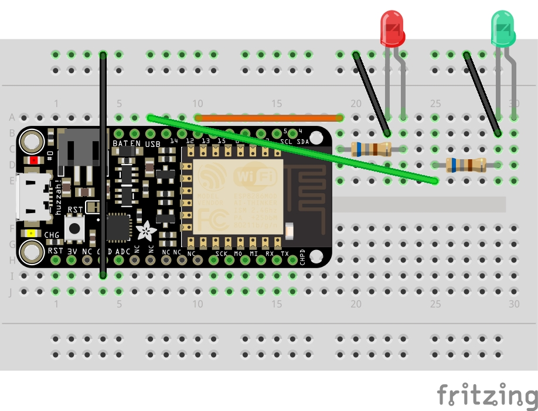
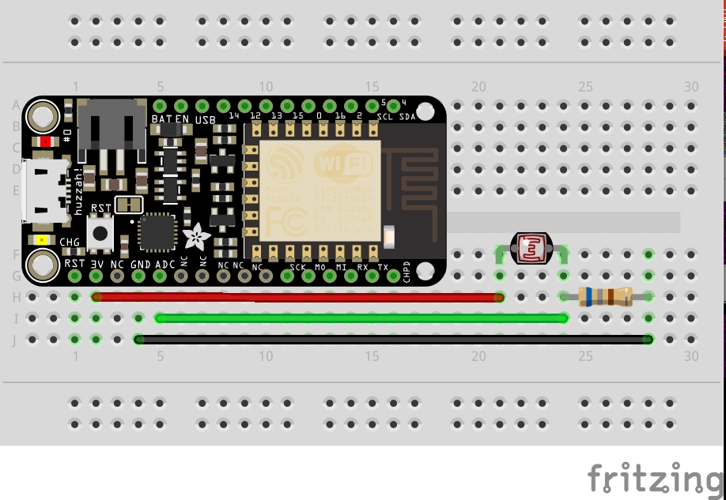

# brown_light
### Demo Gif
One device picks up the light sensor output on the other, and displays an on/off indicator LED light.

### brown_light RX

### brown_light TX

Currently tx and rx are configured with hard-coded IP, polling photoresistor value intervally and sending over UPD.

Roadmap: Implement auto IP setup with [Bonjour/Zeroconf](http://gkaindl.com/software/arduino-ethernet/bonjour)
